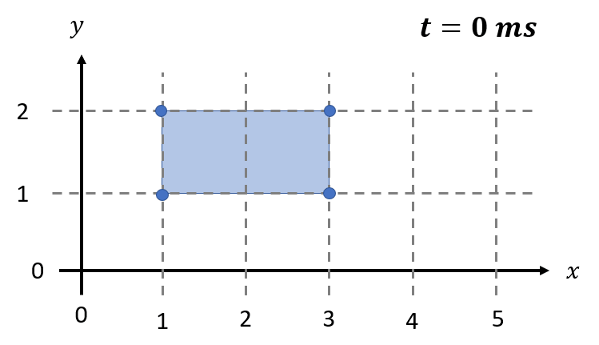

.. spelling:word-list::

    aren
    txt

.. _fileref-polygon_file:

Polygon File
============

Maha Multics "polygon files" are used to store data about a set of polygons
whose vertices may change position over time.

Applications
------------

One of the most common use cases for polygon files is when defining boundary
conditions in lubricating films.  Often, there are known pressures in certain
geometric regions of the film (for instance, in the inlet and outlet ports),
and it is necessary to communicate these geometric conditions to the solver.
A polygon file can be a convenient way to provide this boundary condition.

.. dropdown:: Sample Application: Axial Piston Pump
    :animate: fade-in

    Suppose that you are simulating an `axial piston pump <https://en.wikipedia.org
    /wiki/Axial_piston_pump>`__, and you want to model the cylinder block-valve plate
    interface.

    In this interface, three boundary conditions are of interest, illustrated by
    the figure below.  Note that the geometry in the figure is not representative of
    any real pump; it is for illustration purposes only.  Additionally, while axial
    piston pumps typically have multiple displacement chambers, for simplicity only
    a single displacement chamber is shown in the figure.

    .. figure:: ./images/polygon_file_axial_piston_pump.png

    As seen in the figure above, three boundary conditions must be specified by
    defining polygon-shaped regions:

    - **Low-pressure port (shown in orange)**: This port can have **arbitrary
      shape**, so its location must be specified using a polygon with an
      arbitrary number of vertices.
    - **High-pressure ports (shown in yellow)**: These ports can have arbitrary
      shape, and since the high-pressure side of the valve plate in axial piston
      pumps typically has multiple ports separated by ribs for structural support,
      a **union of disjoint polygons** must be computed to accurately represent
      this boundary condition.
    - **Displacement chamber port (shown in purple)**: The displacement chamber
      port pressure is typically calculated separately from solving the partial
      differential equations (PDEs) governing the film; thus, this port pressure
      can be considered a boundary condition, like the high- and low-pressure
      ports.  An additional challenge is that this is a **moving boundary
      condition**, as the displacement chambers move following the rotation of
      the pump shaft (indicated by the purple arrow in the figure).

    Of course, boundary conditions must also be defined on the inner and outer
    radii of the lubricating film, but these don't need to be specified as
    arbitrary polygons, so they will not be discussed here.

    Once we have defined the shapes of each of these three ports as polygons at
    each time step of the simulation, we can apply a constant-pressure boundary
    condition to each polygon region and use this as a boundary condition to
    solve the governing PDEs in the film.  The polygon file discussed on this
    page addresses provides a data format that supports these needs.

Definitions
-----------

.. dropdown:: Polygon
    :animate: fade-in

    As discussed by `Wolfram MathWorld <https://mathworld.wolfram.com/Polygon.html>`__,
    there is no universally-accepted definition of a polygon.  The definition
    that the Maha Multics software uses a combination of elements of different
    definitions of a polygon from multiple sources.

    In general terms, the Maha Multics software defines a polygon as a closed,
    two-dimensional (2D) region bounded by a series of connected line segments
    that may or may not not intersect themselves.

    Put another way, a polygon can be considered the closed 2D region bounded
    by line segments connecting a cyclical series of points in order, where
    the boundary never intersects itself.

.. dropdown:: Point-in-Polygon Problem
    :animate: fade-in

    A `point-in-polygon problem <https://en.wikipedia.org/wiki/Point_in_polygon>`__
    is a geometric problem attempting to determine whether a given point is
    inside or outside a (possibly self-intersection) polygon.

    There are a number of algorithms that have been proposed for solving the
    point-in-polygon problem.  The Maha Multics software uses the `winding
    number algorithm <https://en.wikipedia.org/wiki/Point_in_polygon#Winding_number_algorithm>`__.

    For more detail on the point-in-polygon and winding number algorithm, refer to
    `this paper <https://www.engr.colostate.edu/~dga/documents/papers/point_in_polygon.pdf>`__.

File Format
-----------

A polygon file stores the :math:`x`- and :math:`y`-coordinates of one or more
polygons, at one or more instants in time.  **The purpose of the file is to store
whether a point is "inside" the polygon(s) at a specific point in time.**  In the
event there are multiple polygons, there are several options for specifying how to
define "inside," as will be discussed below.

.. warning::

    As explained below, the term "time" is used loosely with polygon files.  The
    measure of time does not necessarily need to be "physical time" (i.e.,
    measured in seconds).  Rather, it could be "time" measured as, for example,
    the rotation angle of a pump shaft (in which case ``[TIME_UNIT]`` might be
    ``degrees``).

General Format
^^^^^^^^^^^^^^

There are **two primary parts of a polygon file**: (1) the *header* and (2) the
*polygon coordinates*.  The header lines in the files below are highlighted to
distinguish the two parts of the file.

The standard format of a full polygon file is shown below.  It can seem confusing
at first, so if you aren't sure about the format, skip to the later sections in
which the format is broken down in more detail.  The format is slightly different
if storing one instant in time or multiple instants, and each is described under
the tabs below.

.. tab-set::

    .. tab-item:: Single Time Step
        :sync: polygon-file-single

        .. code-block:: shell
            :emphasize-lines: 1
            :linenos:

            1 [Np] [POLYGON_MERGE_METHOD]
            [NUM_COORD_1] [IS_INSIDE_1]  # <-- polygon 1
            [X_COORDINATE_UNIT]: [X_1] [X_2] ... [X_{NUM_COORD_1}]
            [Y_COORDINATE_UNIT]: [Y_1] [Y_2] ... [Y_{NUM_COORD_1}]
            [NUM_COORD_2] [IS_INSIDE_2]  # <-- polygon 2
            [X_COORDINATE_UNIT]: [X_1] [X_2] ... [X_{NUM_COORD_2}]
            [Y_COORDINATE_UNIT]: [Y_1] [Y_2] ... [Y_{NUM_COORD_2}]
            ...
            [NUM_COORD_j] [IS_INSIDE_j]  # <-- polygon j
            [X_COORDINATE_UNIT]: [X_1] [X_2] ... [X_{NUM_COORD_j}]
            [Y_COORDINATE_UNIT]: [Y_1] [Y_2] ... [Y_{NUM_COORD_j}]
            ...
            [NUM_COORD_Np] [IS_INSIDE_Np]  # <-- polygon NUM_POLYGONS
            [X_COORDINATE_UNIT]: [X_1] [X_2] ... [X_{NUM_COORD_Np}]
            [Y_COORDINATE_UNIT]: [Y_1] [Y_2] ... [Y_{NUM_COORD_Np}]

    .. tab-item:: Multiple Time Steps
        :sync: polygon-file-multiple

        .. code-block:: shell
            :emphasize-lines: 1-2
            :linenos:

            [Nt] [Np] [POLYGON_MERGE_METHOD]
            [TIME_UNIT]: [TIME_BEGIN] [TIME_STEP] [TIME_EXTRAP_METHOD]
            [NUM_COORD_1_1] [IS_INSIDE_1_1]  # <-- time step 1, polygon 1
            [X_COORDINATE_UNIT]: [X_1] [X_2] ... [X_{NUM_COORD_1_1}]
            [Y_COORDINATE_UNIT]: [Y_1] [Y_2] ... [Y_{NUM_COORD_1_1}]
            [NUM_COORD_1_2] [IS_INSIDE_1_2]  # <-- time step 1, polygon 2
            [X_COORDINATE_UNIT]: [X_1] [X_2] ... [X_{NUM_COORD_1_2}]
            [Y_COORDINATE_UNIT]: [Y_1] [Y_2] ... [Y_{NUM_COORD_1_2}]
            ...
            [NUM_COORD_1_Np] [IS_INSIDE_1_Np]  # <-- time step 1, polygon NUM_POLYGONS
            [X_COORDINATE_UNIT]: [X_1] [X_2] ... [X_{NUM_COORD_1_Np}]
            [Y_COORDINATE_UNIT]: [Y_1] [Y_2] ... [Y_{NUM_COORD_1_Np}]
            [NUM_COORD_2_1] [IS_INSIDE_2_1]  # <-- time step 2, polygon 1
            [X_COORDINATE_UNIT]: [X_1] [X_2] ... [X_{NUM_COORD_2_1}]
            [Y_COORDINATE_UNIT]: [Y_1] [Y_2] ... [Y_{NUM_COORD_2_1}]
            ...
            [NUM_COORD_i_j] [IS_INSIDE_i_j]  # <-- time step i, polygon j
            [X_COORDINATE_UNIT]: [X_1] [X_2] ... [X_{NUM_COORD_i_j}]
            [Y_COORDINATE_UNIT]: [Y_1] [Y_2] ... [Y_{NUM_COORD_i_j}]
            ...
            [NUM_COORD_Nt_Np] [IS_INSIDE_Nt_Np]  # <-- time step NUM_TIME_STEPS, polygon NUM_POLYGONS
            [X_COORDINATE_UNIT]: [X_1] [X_2] ... [X_{NUM_COORD_Nt_Np}]
            [Y_COORDINATE_UNIT]: [Y_1] [Y_2] ... [Y_{NUM_COORD_Nt_Np}]

Note that *the numbers on the left-hand side are line numbers, and they
are not part of the file*.

.. _fileref-polygon_file-header:

Section 1: Header
^^^^^^^^^^^^^^^^^

The header contains metadata about the polygon file, formatted as follows:

.. tab-set::

    .. tab-item:: Single Time Step
        :sync: polygon-file-single

        .. code-block:: shell
            :linenos:

            1 [Np] [POLYGON_MERGE_METHOD]

    .. tab-item:: Multiple Time Steps
        :sync: polygon-file-multiple

        .. code-block:: shell
            :linenos:

            [Nt] [Np] [POLYGON_MERGE_METHOD]
            [TIME_UNIT]: [TIME_BEGIN] [TIME_STEP] [TIME_EXTRAP_METHOD]

All parameters must be **whitespace-separated**.

Header Parameters for All Polygon Files
"""""""""""""""""""""""""""""""""""""""

These parameters should be included in **all** polygon files.

.. dropdown:: ``[Nt]``: Number of Time Steps
    :animate: fade-in

    The **number of time steps in the file**.  Note that for files with a single
    time step, ``Nt`` must be 1 (as shown in the code block above).

    Must be an integer greater than or equal to 1.

.. dropdown:: ``[Np]``: Number of Polygons per Time Step
    :animate: fade-in

    The **number of polygons per time step** in the file, which **must** be the
    same for **all** time steps.

    Must be an integer greater than or equal to 1.

    .. important::

        The Maha Multics software requires that the number of polygons is the
        same for all time steps.  This is an internal limitation of the software.

.. dropdown:: ``[POLYGON_MERGE_METHOD]``: Method for Combining Disjoint Polygons
    :animate: fade-in

    In the event that there are multiple polygons per time step (i.e., ``Np > 1``),
    there are a variety of ways they could be combined.  We might want to know
    whether a point is inside of *all* of the specified polygons, or *any* of
    them, as a few examples.

    There are three supported options for combining multiple disjoint polygons:

    .. list-table::
        :header-rows: 1
        :widths: 1 3

        * - ``[POLYGON_MERGE_METHOD]``
          - Description
        * - ``0``
          - If a point is considered "inside" of the union of polygons in the
            file if it is inside of *any* of the ``Np`` polygons.
        * - ``1``
          - If a point is considered "inside" of the union of polygons in the
            file if it is inside of *all* of the ``Np`` polygons.
        * - ``2``
          - If a point is considered "inside" of the union of polygons in the
            file if it is inside of *exactly one* of the ``Np`` polygons.

    Note that whether a point is inside of each of the ``Np`` polygons will
    be defined by the ``IS_INSIDE`` parameter, discussed in the
    :ref:`fileref-polygon_file-coordinates` section.

    This parameters is only relevant for polygon files in which ``Np > 1``
    but a value should be included in all polygon files (if ``Np = 1``, this
    parameter is simply ignored).

Header Parameters for Files with Multiple Time Steps
""""""""""""""""""""""""""""""""""""""""""""""""""""

These parameters should be included **only** for polygon files multiple time steps (``Nt > 1``).

.. dropdown:: ``[TIME_UNIT]``: Time Unit
    :animate: fade-in

    A string describing the units in which the ``[TIME_BEGIN]`` and ``[TIME_STEP]``
    parameters are defined.

    .. note::
        Recall that the Maha Multics software uses "time" loosely, and the "time" can
        also be defined in terms of quantities such as "degrees of rotation of the
        pump shaft" or similar.

.. dropdown:: ``[TIME_BEGIN]``: Initial Time
    :animate: fade-in

    An integer or decimal number specifying the time for the first set of
    polygons stored in the file.

.. dropdown:: ``[TIME_STEP]``: Constant Time Step
    :animate: fade-in

    - **Type:** Floating-point number
    - **Restrictions:** Must be a real number greater than 0

    An integer or decimal number specifying the time step between each of
    the ``[NUM_POLYGONS]`` specified polygons.

    .. important::

        The Maha Multics software requires that the time step is constant.  This
        is an internal limitation of the software.

.. dropdown:: ``[TIME_EXTRAP_METHOD]``: Extrapolation for Time Values
    :animate: fade-in

    The parameters ``[NUM_TIME_STEPS]``, ``[TIME_BEGIN]``, and ``[TIME_STEP]``
    specify a range of times over which polygons will be provided; let us
    denote this range :math:`t \in [t_{min}, t_{max}]`.  This poses an
    issue: what should be done if the time :math:`t` falls outside this range?

    It is not straightforward to "interpolate" or "extrapolate" polygons,
    since they can have an arbitrary number of coordinates that change in
    arbitrary ways each time step.  Therefore, if :math:`t` falls outside
    :math:`[t_{min}, t_{max}]`, it must be "rescaled" to fall in this range.

    Two options are provided for this "rescaling," described below:

    .. list-table::
        :header-rows: 1
        :widths: 1 3

        * - ``[TIME_EXTRAP_METHOD]``
          - Description
        * - **0** or **2** (saturation)
          - When reading data from the polygon file, if :math:`t \lt t_{min}`,
            it is rescaled by :math:`t = t_{min}`, and if :math:`t \gt t_{max}`,
            it is rescaled by :math:`t = t_{max}`.
        * - **3** (periodic)
          - Assumes that the polygon data are periodic with period
            :math:`t_{min} - t_{max}`.  If :math:`t` falls outside the range
            :math:`[t_{min}, t_{max}]`, it is rescaled by
            :math:`t = ((t - t_{min}) \% (t_{max} - t_{min})) + t_{min}`,
            where :math:`\%` denotes the modulo operator.

    .. note::

        Why is ``1`` not an option?  This is unfortunately a limitation hard-coded
        in the Maha Multics source code.

.. _fileref-polygon_file-coordinates:

Section 2: Polygon Coordinates
^^^^^^^^^^^^^^^^^^^^^^^^^^^^^^

This section contains the :math:`x`- and :math:`y`-coordinates for all polygons
in the file, for every time step.  The general structure for specifying these
points (for a single polygon) is shown below:

.. code-block:: text

    [NUM_COORD] [IS_INSIDE]
    [X_COORDINATE_UNIT]: [X_1] [X_2] ... [X_{NUM_COORD}]
    [Y_COORDINATE_UNIT]: [Y_1] [Y_2] ... [Y_{NUM_COORD}]

Note that Section 2 of a polygon file typically contains a number of code blocks
similar to above.  However, each has the same format, so only a single such block
will be discussed here.  To see how to use multiple such blocks, refer to the
:ref:`fileref-polygon_file-examples` section.

The following parameters must be included in this section:

.. dropdown:: ``[NUM_COORD]``: Number of Points on Polygon Perimeter
    :animate: fade-in

    The number of :math:`x`- and :math:`y`-coordinates specifying the polygon
    perimeter.

    Must be an integer greater than or equal to 3.

    .. note::

        This information is technically redundant since the coordinates themselves
        are given.  This is an internal limitation of the Maha Multics software.

.. dropdown:: ``[IS_INSIDE]``: How to Define Area "Inside" the Polygon
    :animate: fade-in

    This input clarifies, for every polygon, what area is considered to be "inside"
    the polygon.  A polygon encloses a given geometric region, and this area is
    typically considered to be "inside" the polygon if ``IS_INSIDE`` is set to 1.
    However, setting ``IS_INSIDE`` to 0 will reverse this convention.  The figure
    below illustrates these conventions visually.

    .. figure:: ./images/polygon_file_is_inside.png
        :width: 75%

    .. note::

        This value should almost always be ``1``.  It is primarily included in
        the Maha Multics software for backwards compatibility.

.. dropdown:: ``[X_COORDINATE_UNIT]`` and ``[Y_COORDINATE_UNIT]``: Units
    :animate: fade-in

    These parameters specify the units for the :math:`x`- and
    :math:`y`-coordinates specified **on the same line as the unit**.

.. dropdown:: ``[X_1], [Y_1], ..., [X_N], [Y_N]``: Perimeter Coordinates
    :animate: fade-in

    The :math:`x`- and :math:`y`-coordinates of the polygon perimeter must be
    provided on two separate lines.  All coordinates should be **whitespace-separated**,
    and there should be a total of ``NUM_COORD`` :math:`x`-coordinates and
    ``NUM_COORD`` :math:`y`-coordinates.

Comments, Whitespace, and Line Endings
--------------------------------------

Comments should not be used in polygon files.

Items denoted "whitespace-separated" may be separated by either spaces
or tab (``\t``) characters.

Blank lines may be included but are not recommended.

On Linux and MacOS, LF line endings (``\n``) must be used.  On Windows,
either LF (``\n``) or CRLF (``\r\n``) line endings may be used.

.. _fileref-polygon_file-examples:

Examples
--------

Single, Stationary Polygon
^^^^^^^^^^^^^^^^^^^^^^^^^^

Consider perhaps the simplest possible polygon file: a single polygon, at a single
time step.  Suppose that we want to describe a rectangle with vertices :math:`(1, 0)`,
:math:`(5, 0)`, :math:`(5, 2.5)`, :math:`(1, 2.5)`.

In this case, there is one time step (``Nt = 1``) and a single polygon (``Np = 1``).
Since there is only one polygon, ``POLYGON_MERGE_METHOD`` is not relevant (we'll
set it to 0 for this example).  We'll assume that all coordinates are in units of
``m`` and that the area enclosed by the rectangle is "inside" the polygon
(``IS_INSIDE = 1``).

Taken together, these parameters result in the following polygon file:

.. code-block:: text
    :caption: polygon_file_single_stationary.txt

    1 1 0
    4 1
    m: 1  5  5    1
    m: 0  0  2.5  2.5

Multiple, Stationary Polygons
^^^^^^^^^^^^^^^^^^^^^^^^^^^^^

Let's extend the previous example to describe the area inside of a union of two polygons:

1. A rectangle with vertices :math:`(1, 0)`, :math:`(5, 0)`, :math:`(5, 2.5)`, :math:`(1, 2.5)`
2. A triangle with vertices :math:`(5, 0)`, :math:`(5, 2.5)`, :math:`(7.5, 0)`

Visually, this union is the following pentagon:

In this example, there is one time step (``Nt = 1``) and two polygons (``Np = 2``).  Since
we want to consider the area enclosed by either of the two polygons as "inside" their
union, ``POLYGON_MERGE_METHOD`` should be 0.  We'll assume that all coordinates are in
units of ``cm`` and that the area enclosed by both the rectangle and triangle is "inside"
the polygon union (``IS_INSIDE = 1``).

Taken together, these parameters result in the following polygon file:

.. code-block:: text
    :caption: polygon_file_multiple_stationary.txt

    1 2 0
    4 1
    cm: 1  5  5    1
    cm: 0  0  2.5  2.5
    3 1
    cm: 5  5    7.5
    cm: 0  2.5  0

Single, Moving Polygon
^^^^^^^^^^^^^^^^^^^^^^

Finally, consider a case in which a polygon is moving.  This is particularly
applicable to fluid power applications, as this may reflect the moving
boundary conditions in lubricating films.

As a simple example, consider a rectangular polygon that moves between
:math:`t = 0\ ms` and :math:`t = 2\ ms` as shown below.

Thus, the rectangle has the following vertices at each time step:

.. list-table::
    :header-rows: 1
    :widths: 1 3

    * - :math:`t`
      - Vertices
    * - :math:`0\ ms`
      - :math:`(1, 1)`, :math:`(3, 1)`, :math:`(3, 2)`, :math:`(1, 2)`
    * - :math:`1\ ms`
      - :math:`(2, 1)`, :math:`(4, 1)`, :math:`(4, 2)`, :math:`(2, 2)`
    * - :math:`2\ ms`
      - :math:`(3, 1)`, :math:`(5, 1)`, :math:`(5, 2)`, :math:`(3, 2)`

In this case, there are three time steps (``Nt = 3``) and one polygon (``Np = 1``).
Since there is only one polygon, ``POLYGON_MERGE_METHOD`` is not relevant (we'll
set it to 0 for this example).  The units of time are ``ms`` (``[TIME_UNITS] = ms``),
and since the time begins at zero and advances in :math:`1\ ms` increments,
``[TIME_BEGIN] = 0`` and ``[TIME_STEP] = 1``.  Assuming that we want to use
"saturation" for time extrapolation, ``[TIME_EXTRAP_METHOD] = 0``.

Based on the parameters described above and assuming that the coordinates are in
units of ``ft``, these parameters result in the following polygon file:

.. code-block:: text
    :caption: polygon_file_single_moving.txt

    3 1 0
    ms: 0 1 0
    4 1
    cm: 1  3  3  1
    cm: 1  1  2  2
    4 1
    cm: 2  4  4  2
    cm: 1  1  2  2
    4 1
    cm: 3  5  5  3
    cm: 1  1  2  2
