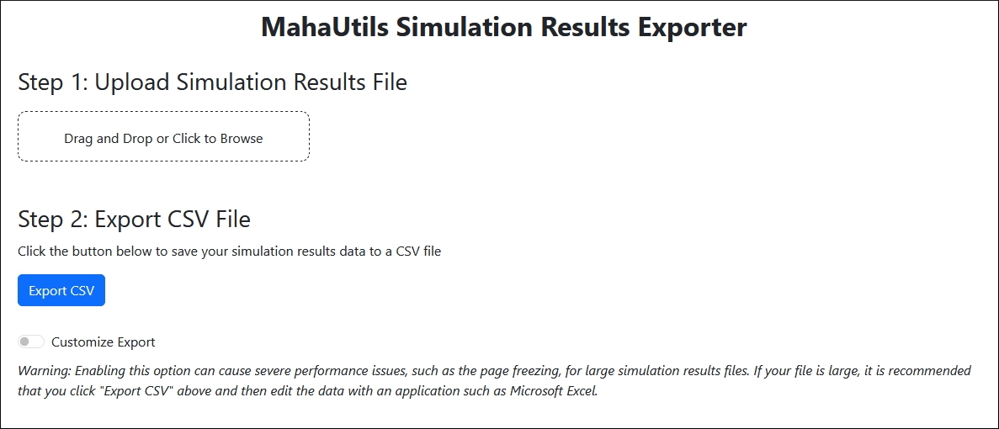
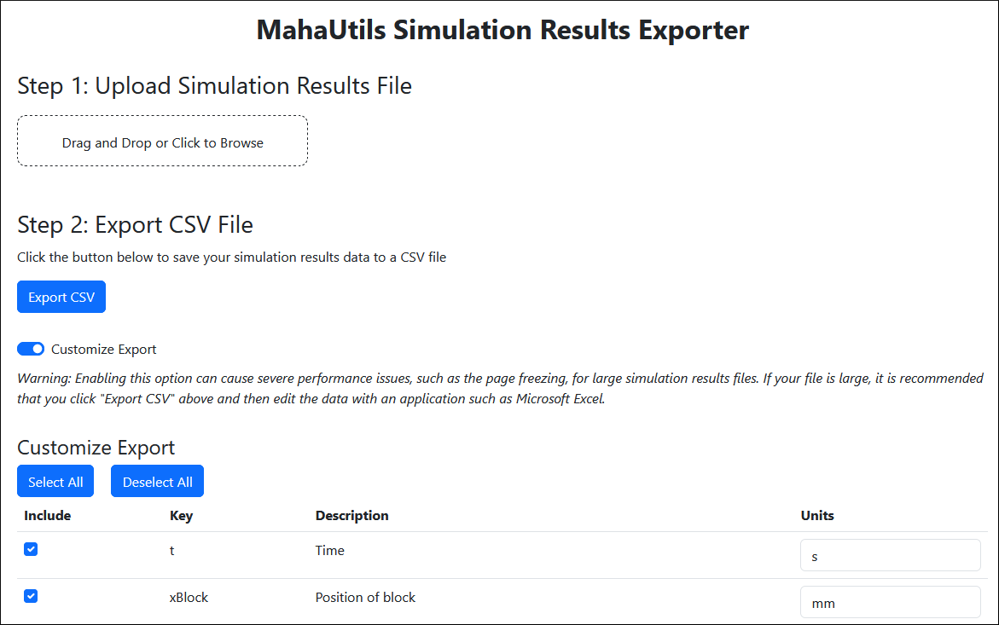
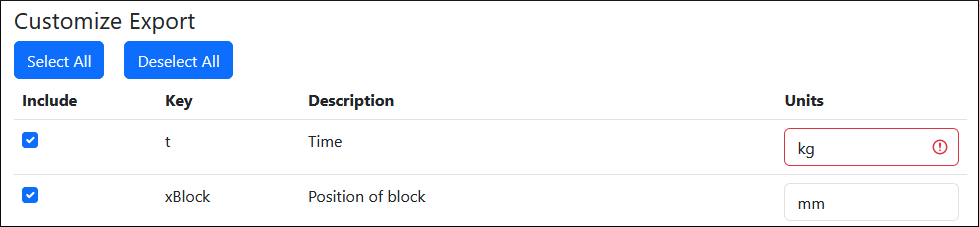

.. include:: ../../constants.rst

.. spelling:word-list::

    SimExporter
    ve

SimExporter GUI
===============

The SimExporter graphical user interface (GUI) is a tool for exporting data
from Maha Multics simulation results files to CSV files.  This can be helpful
if analyzing simulation results with software such as Microsoft Excel.  The GUI
is built on `Plotly Dash <https://plotly.com/dash/>`__ and runs in a web
browser, so it is compatible with most operating systems.

Installation
------------

Follow the :ref:`installation instructions <section-installation>` to install the
|PackageNameStylized| package on your computer with pip.  Once this package is
installed, SimExporter will be available.

Alternatively, if you just want to try out SimExporter or for any reason cannot
install the package on your system, you can use
`GitHub Codespaces <https://github.com/features/codespaces>`__ to test the
GUI.  Note that a GitHub account is required.

.. raw:: html

    

Command-Line Options
--------------------

SimExporter is a graphical tool, but it must be launched from the command line.  To
run SimExporter, simply open a terminal (activating your virtual environment, if
applicable), and run:

.. code-block:: shell

    SimExporter

Note that there are several optional command-line arguments.  To view these
options, run:

.. code-block:: shell

    SimExporter --help

One important option to notice is ``--port``.  SimExporter runs as a web app, and
this argument sets the port on which the app is served.  For instance, to
launch a SimExporter instance on port 9876, run:

.. code-block:: shell

    SimExporter --port 9876

.. important::

    If running multiple SimExporter instances, be sure to use a different port
    for each instance.

Exporting Simulation Results Data
---------------------------------

Once you've launched SimExporter, the user interface is relatively
self-explanatory.  First, upload your ``simulation_results.txt`` file:

Then, click "Export CSV" to save the simulation results data to a comma-separated
value (CSV) file:

Customizing Exported Data
-------------------------

.. warning::

    For large simulation results files (with hundreds or more output variables),
    SimExporter performance may significantly decline and the page may become
    unresponsive.  If this occurs, it is recommended that you simply click
    "Export CSV" to save all variables, and then remove unnecessary columns in
    Microsoft Excel or a similar tool.

Clicking the "Customize Export" dropdown provides access to additional options for
exporting your data.

If you do not want to export all simulation results variables, simply uncheck
any variables to suppress exporting them.  Likewise, if you want to change the
units of any exported data, edit the "Units" column.

Note that if you provide invalid units (either not a valid conversion for the specified
variable or not listed on the :ref:`default unit converter <section-unitconverter_units>`
page), an error will be displayed and the "Export CSV" button will be grayed out.

