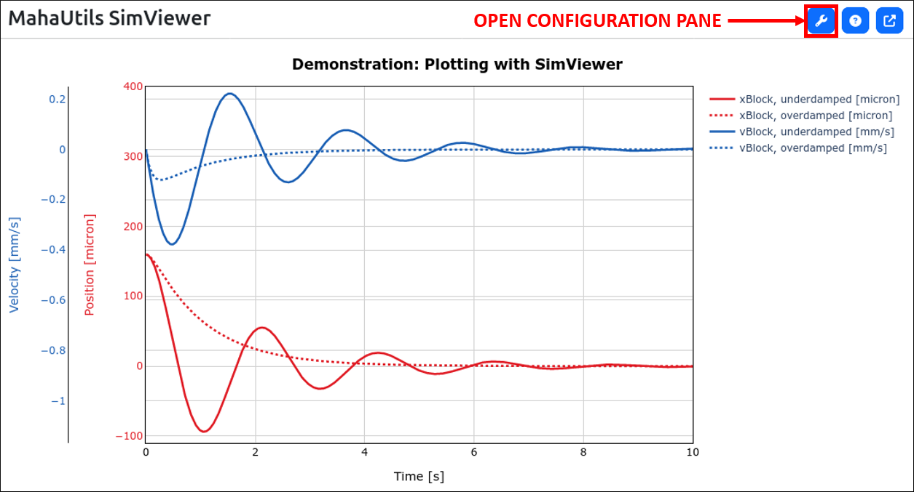
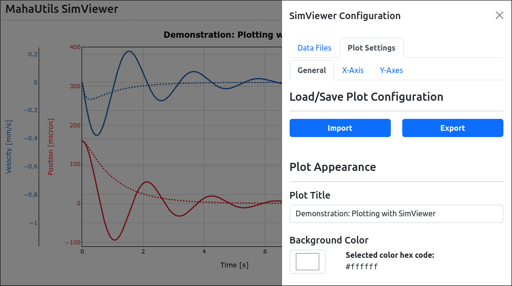
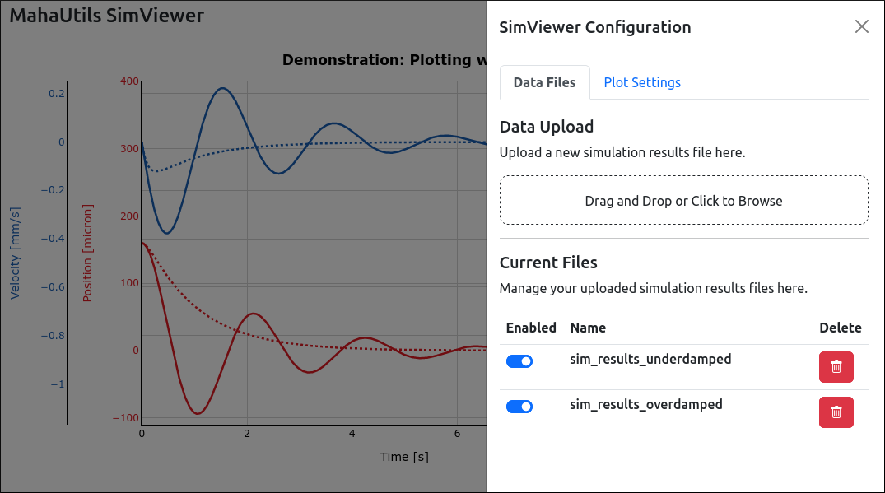
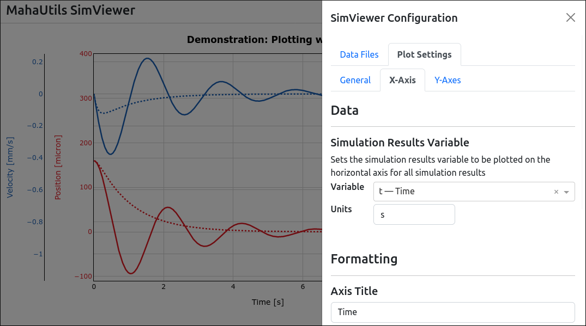
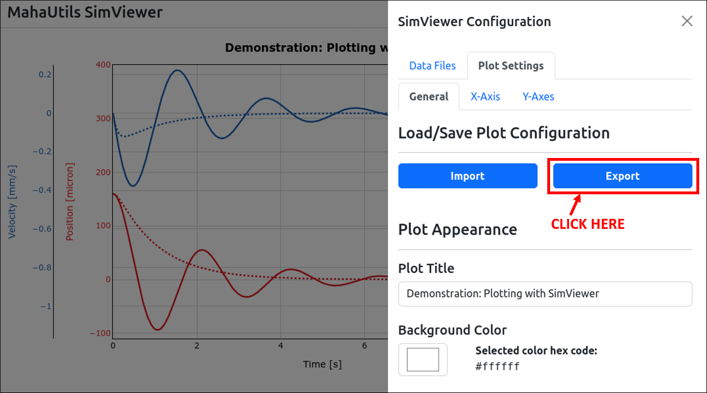

.. include:: ../../constants.rst

.. spelling:word-list::

    SimViewer
    ve

SimViewer GUI
=============

The SimViewer graphical user interface (GUI) is a tool for quickly plotting
and visualizing Maha Multics simulation results files.  It is built on
`Plotly Dash <https://plotly.com/dash/>`__ and runs in a web browser, so it
is compatible with most operating systems.

Most of the features of the SimViewer tool are self-explanatory, so this guide
will describe everything in detail, instead highlighting key features.

.. note::

    Try it out!  As you follow along this guide, feel free to use these sample
    simulation results files to try out the features:
    :download:`sim_results_underdamped.txt <../../../../demo_files/sim_results_underdamped.txt>`,
    :download:`sim_results_overdamped.txt <../../../../demo_files/sim_results_overdamped.txt>`

    These files are hypothetical simulations illustrating typical underdamped and
    overdamped `transient responses <https://en.wikipedia.org/wiki/Transient_response>`__.

Motivation
----------

SimViewer is designed to assist in quick exploration of simulation results
data.  Several priorities were considered when designing the tool:

- The general use case is for Maha Multics numerical simulations, where the
  simulation generates a number of different properties (body positions,
  friction forces, etc.) that are all a function of time (or some measure of
  time, such as shaft position).  Therefore, it is necessary to plot multiple
  variables, possibly with very different scales, as a function of a single
  variable (time).
- Often, similar plots need to be generated for multiple simulations.  For
  instance, one might be experimenting with different mesh sizes and need to
  generate the same plots of pressure and film thickness.  SimViewer provides
  an option to save plot configuration files so that plots can be rapidly
  generated.
- Sometimes, results from multiple simulations need to be compared.  SimViewer
  allows users to load and compare an arbitrary number of simulation results
  (assuming your system has enough memory to support it).

Launching SimViewer
-------------------

Installation
^^^^^^^^^^^^

Follow the :ref:`installation instructions <section-installation>` to install the
|PackageNameStylized| package on your computer with pip.  Once this package is
installed, SimViewer will be available.

Alternatively, if you just want to try out SimViewer or for any reason cannot
install the package on your system, you can use
`GitHub Codespaces <https://github.com/features/codespaces>`__ to test the
GUI.  Note that a GitHub account is required.

.. raw:: html

    

Command-Line Options
^^^^^^^^^^^^^^^^^^^^

SimViewer is a graphical tool, but it must be launched from the command line.  To
run SimViewer, simply open a terminal (activating your virtual environment, if
applicable), and run:

.. code-block:: shell

    SimViewer

Note that there are several optional command-line arguments.  To view these
options, run:

.. code-block:: shell

    SimViewer --help

One important option to notice is ``--port``.  SimViewer runs as a web app, and
this argument sets the port on which the app is served.  For instance, to
launch a SimViewer instance on port 9876, run:

.. code-block:: shell

    SimViewer --port 9876

.. important::

    If running multiple SimViewer instances, be sure to use a different port
    for each instance.

Configuring Plot Settings
^^^^^^^^^^^^^^^^^^^^^^^^^

Almost all plot configuration settings can be edited through the **configuration
pane**, which can be opened using the icon in the top-right corner:

This should open a panel that contains a number of options for managing data
and plot formatting:

Loading Data
------------

The first step when using SimViewer is to load Maha Multics simulation results
files to plot.  This can be accomplished on the "Data Files" tab:

Either drag-and-drop your file, or click the dotted box and browse to your
file.  When uploading files, you will be asked to enter a name for the file.
This should be a short identifier that you can use later to select which
file to plot data from, so choose a short but descriptive name.

The "Current Files" section of the "Data Files" tab lists all currently
loaded data files and offers the following options:

- **Enabled switches**: These represent a "global" on/off switch that will
  show or hide all data series associated with a file.
- **Delete buttons**: Deletes the simulation results file.

Plotting Data
-------------

The key principle behind SimViewer is that when plotting Maha Multics simulation
results, it is typical that there is a **single independent variable** (time, or
some measure of time such as shaft rotation angle) and **multiple dependent
variables**.  In this documentation, the independent variable is assumed to be
plotted on the (horizontal) :math:`x`-axis, and the dependent variables -- referred
to as **data series** -- are plotted on the (vertical) :math:`y`-axis.  In
addition, SimViewer offers the capacity to create *multiple* :math:`y`-axes to
group data series.

Plot Configuration: :math:`x`-axis
^^^^^^^^^^^^^^^^^^^^^^^^^^^^^^^^^^

The first step when plotting simulation results data is to select the independent
variable.  This can be performed on the "X-Axis" tab:

Because we assume that there is a single independent (time) variable, the x-axis
variable can be selected from any simulation results variable that is present in
**all** uploaded simulation results files.

Notice that it is required to set units for the independent variable.  Any units
defined in the :ref:`default unit converter <section-unitconverter_units>` can
be chosen; unit conversions are performed automatically.

Plot Configuration: :math:`y`-axes
^^^^^^^^^^^^^^^^^^^^^^^^^^^^^^^^^^

Next, we need to select which data series (i.e., dependent variables) to plot.
These options can be selected on the "Y-Axes" tab:

.. figure:: ./images/y_axis_config.png

As mentioned previously, it is possible to create multiple :math:`y`-axes.
These can be managed under the "Y-Axis Selector" section -- here, you can
switch between :math:`y`-axes, create/delete axes, and hide/show an axis.
Additionally, you can set a number of formatting options, such as the title
for the :math:`y`-axis and a color (to make it visually easier to identify).

Each :math:`y`-axis can plot one or more data series (each of which can be
selected from any simulation results file).  To manage data series for a
particular :math:`y`-axis, select the axis under the "Y-Axis Selector" section,
and then scroll down to the "Data Series Configuration" section:

In this section, you can add any desired data series to the :math:`y`-axis.
Simply select the file from which the data series should be obtained, and
which variable and units with which to plot the data.  Any units defined in
the :ref:`default unit converter <section-unitconverter_units>` can be
chosen; unit conversions are performed automatically.

Similar to the :math:`y`-axis selection, you can switch between and manage
(add, delete, hide, show) data series using the controls in the "Data Series
Configuration" section.  In addition, formatting options are available to
change line colors, width, and style.

Downloading Plots
-----------------

Once you've generated a beautiful SimViewer plot, you may be wondering...how
can I download it to frame and hang on my wall?

We've got you covered!  Just click the "download plot" button:

You can even customize the file format, aspect ratio, and image sizing under
the "General" settings tab:

Saving Plot Configuration
-------------------------

Often, when plotting simulation results, the same plots are created repeatedly.
For instance, you might be developing code for a simulation and want to check
how the results compare after each iteration.  Rather than having to manually
create new plots each time, SimViewer provides a means to store your plot
settings and generate desired figures with the click of a button.

Exporting Plot Configuration Settings
^^^^^^^^^^^^^^^^^^^^^^^^^^^^^^^^^^^^^

Once you have configured your plot with all desired options, navigate to the
"General" tab and click the "Export" button:

This will save all plot configuration settings to a JSON file.

Importing Plot Configuration Settings
^^^^^^^^^^^^^^^^^^^^^^^^^^^^^^^^^^^^^

Later, if you want to create the same set of plots with SimViewer, follow
these steps to restore the same plot settings using this configuration file:

1. Launch SimViewer and import your simulation results files (under the "Data
   Files" tab), making sure to label the files with the same names as you did
   originally when creating the JSON configuration file.
2. Navigate to the "General" tab and select "Import" to load your JSON
   configuration file. *(tip: you can also simply drag-and-drop your JSON
   configuration file onto the "Import" button)*

The plot should automatically be updated and restore your previous
configuration.

.. important::

    Be sure to upload your simulation results files (under the "Data Files"
    tab) **before** you import the JSON configuration file.  Additionally,
    make sure that when loading the simulation results files, you choose the
    same names as you did when originally creating the JSON configuration file.

Note that you can also use this JSON configuration file to generate plots of
the same :math:`x`- and :math:`y`-variables from *different* Maha Multics
simulation results files -- just use the same name when uploading the files.
