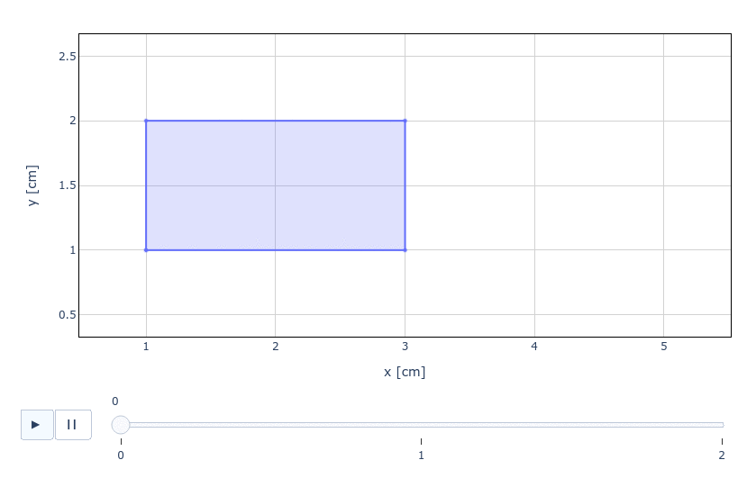
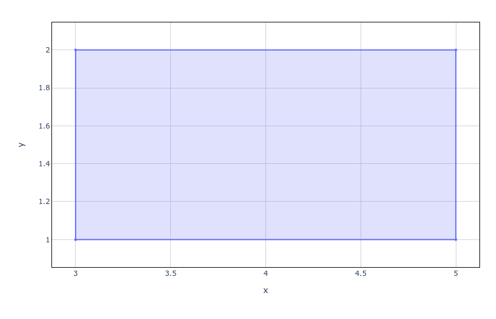
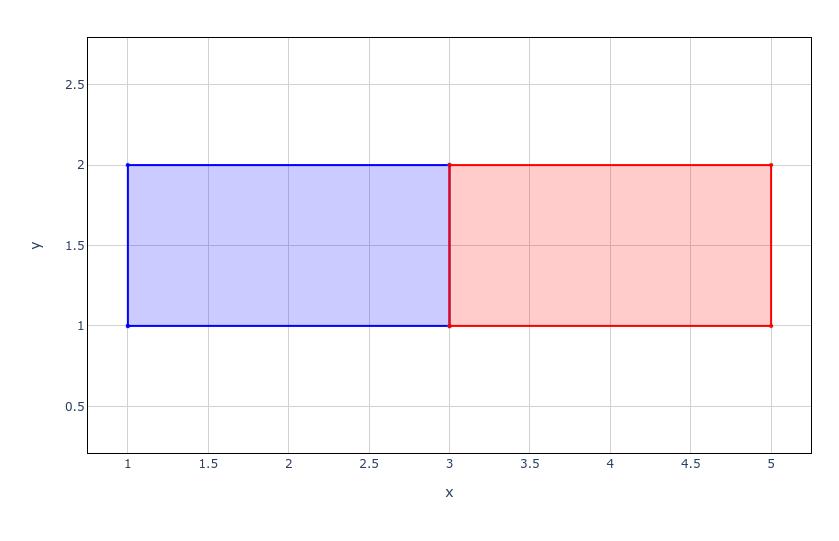

.. include:: ../../constants.rst

.. _section-tutorials_polygonfile_read:

Reading and Plotting Polygon Files
==================================

A common preprocessing step prior to running a Maha Multics simulation is to
create polygon files defining boundary conditions.  This section describes how
to visualize polygon files using the :py:class:`mahautils.multics.PolygonFile`
to confirm correct properties and geometry.

.. note::

    For more details on the format of polygon files, refer to
    the :ref:`fileref-polygon_file` page.

Setup
-----

To begin, download this sample polygon file and save it in your working
directory: :download:`polygon_file.txt <example_files/polygon_file.txt>`.
Note that this file was taken from the :ref:`fileref-polygon_file-example3`
example on the :ref:`fileref-polygon_file` page.

Additionally, be sure to import |PackageNameStylized|:

>>> import mahautils

Reading the File
----------------

Reading the file is easy!  Just create a new :py:class:`mahautils.multics.PolygonFile`
and provide the path of the file you downloaded in the constructor:

.. testsetup::

    import os
    import shutil

    original_working_dir = os.getcwd()
    os.chdir('./source/usage/tutorials')
    shutil.copyfile('./example_files/polygon_file.txt',
                    './polygon_file.txt')

>>> polygon_file = mahautils.multics.PolygonFile('polygon_file.txt')

Viewing Polygon File Data
-------------------------

Time Steps
^^^^^^^^^^

As explained on the :ref:`fileref-polygon_file` page, polygon files store geometry
at a discrete set of time values.  Naturally, one of the first steps we may want
to perform is to view the time values at which data are stored in the polygon file.

We can view all time values at which data are defined in the polygon file using:

>>> print(polygon_file.time_values)
[0.0, 1.0, 2.0]

The units in which the time values are displayed can be retrieved using:

>>> print(polygon_file.time_units)
ms

In order to write or plot the polygon file, the time values must be defined at
a constant interval (or "time step").  We can view this time step using the
:py:meth:`mahautils.multics.PolygonFile.time_step` method, specifying the units
we'd like the time step to be returned in:

>>> print(polygon_file.time_step(units='ms'))
1.0
>>> print(polygon_file.time_step(units='s'))
0.001

Polygon Data
^^^^^^^^^^^^

The geometry in the polygon file for each time step can be accessed through
the :py:attr:`mahautils.multics.PolygonFile.polygon_data` property.

This property contains a :py:class:`mahautils.utils.Dictionary` instance in which
each key is a time step and each value is a :py:class:`mahautils.shapes.Layer`
instance containing the geometry for the time step.

For example, suppose we want to view the vertices of the polygon at :math:`t = 1\ ms`
in the sample polygon file for this tutorial.  We could accomplish this with:

>>> layer_t1 = polygon_file.polygon_data[1]  # extract the layer at t = 1 ms
>>> polygon = layer_t1[0]  # extract the first polygon from the layer
>>> print(polygon.points())  # display polygon vertices
(array([2., 1.]), array([4., 1.]), array([4., 2.]), array([2., 2.]))

Note that this property provides a *reference* to the dictionary in which the
polygon data are stored.  This means that if you were to modify returned values
(such as ``layer_t1`` or ``polygon`` in the example above), this would alter data
in the polygon file object (the ``polygon_file`` variable in the example above).
It is possible to instead obtain a *copy* of the dictionary by accessing the
:py:attr:`mahautils.multics.PolygonFile.polygon_data_readonly` property; modifying
returned values from this property will *not* modify internal data in the polygon
file object.

Plotting the Polygon File
-------------------------

.. note::

    |PackageNameStylized| uses the outstanding `Plotly package <https://plotly.com/python/>`__
    for generating figures.  One of the advantages of this design is that it means
    that plots generated by |PackageNameStylized| provide all interactivity of Plotly
    figures -- you can zoom, export to a PNG file, draw reference shapes, and more.

Animating All Time Steps
^^^^^^^^^^^^^^^^^^^^^^^^

To visualize the polygon file, simply run the :py:meth:`mahautils.multics.PolygonFile.plot`
method:

>>> polygon_file.plot()  # doctest: +SKIP

This should open a browser and show an animated visualization of the geometry in
the polygon file similar to:

You can speed up or slow down the animation by setting the ``delay`` argument, with
units of milliseconds.  For instance, to advance between time steps every 2 seconds:

>>> polygon_file.plot(delay=2000)  # doctest: +SKIP

Plotting a Single Time Step
^^^^^^^^^^^^^^^^^^^^^^^^^^^

Rather than animating all time steps in the polygon file, we might be interested in
plotting a *specific* time step.  This can be easily accomplished by first accessing
the desired time step through the :py:attr:`mahautils.multics.PolygonFile.polygon_data`
property, and then using the :py:meth:`mahautils.shapes.Layer.plot` method to plot
the geometry for the given time step.

For instance, suppose we want to plot the geometry at :math:`t = 2\ ms`.

>>> polygon_file.polygon_data[2].plot()  # doctest: +SKIP

This should open a browser and display a figure similar to:

Using Plotly figures, it is possible to create much more advanced figures.  For
example, if we wanted to plot the polygon file geometry at :math:`t = 0\ ms`
and :math:`t = 2\ ms` on the same plot, we could use the following commands:

>>> # Make the layers for each time step different colors
>>> polygon_file.polygon_data[0].color = 'blue'
>>> polygon_file.polygon_data[2].color = 'red'

>>> # Use "return_fig=True" to return the figure so we can modify it later
>>> fig = polygon_file.polygon_data[0].plot(show=False, return_fig=True)

>>> # Append the layer for a second time step to the figure
>>> fig = polygon_file.polygon_data[2].plot(figure=fig, show=False, return_fig=True)

>>> # Display the figure
>>> fig.show()  # doctest: +SKIP

The result should look similar to this, where the polygon data for
:math:`t = 0\ ms` is red and the data for :math:`t = 2\ ms` is blue:

.. testcleanup::

    os.remove('polygon_file.txt')
    os.chdir(original_working_dir)
