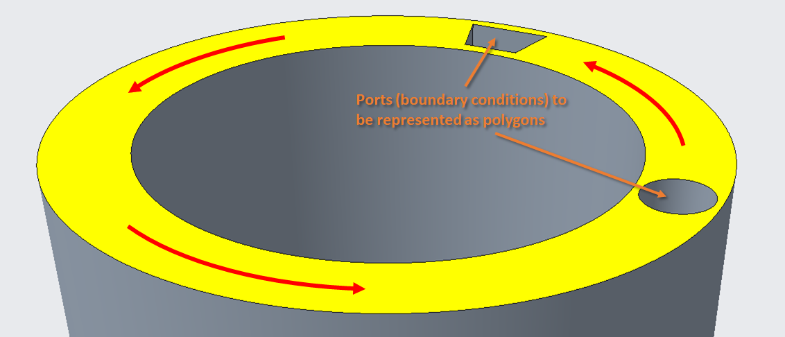
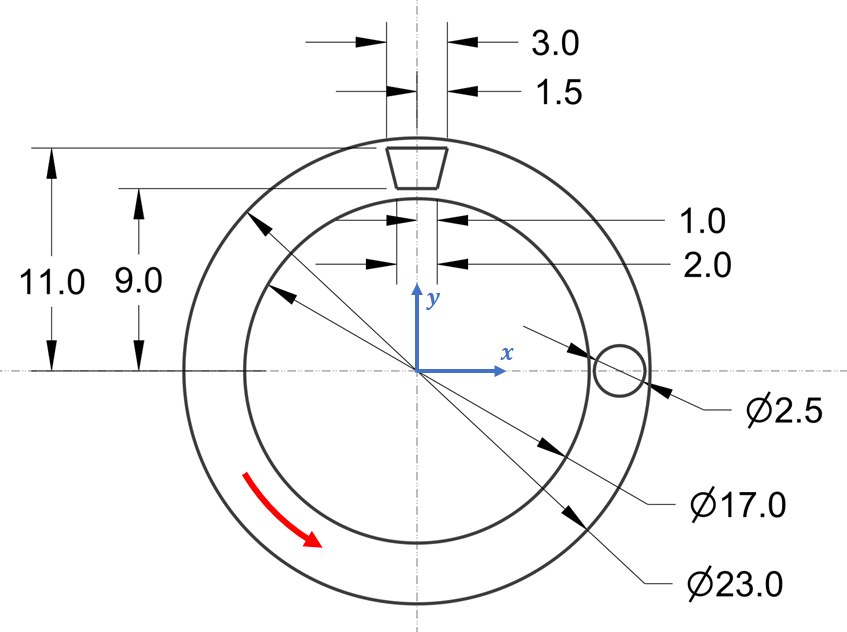
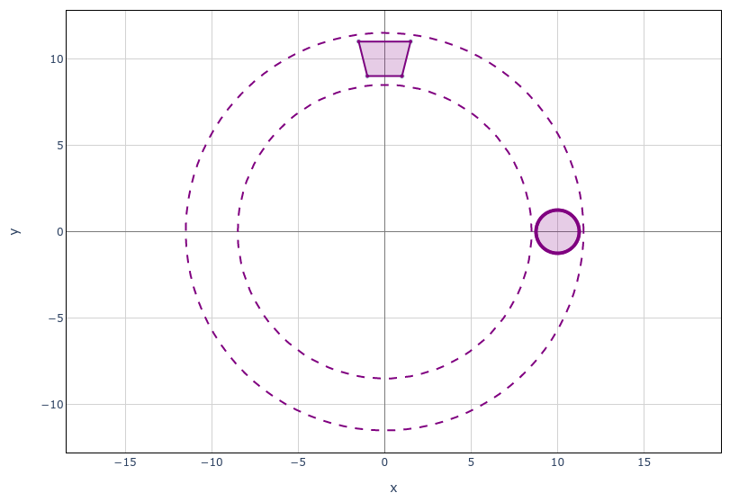
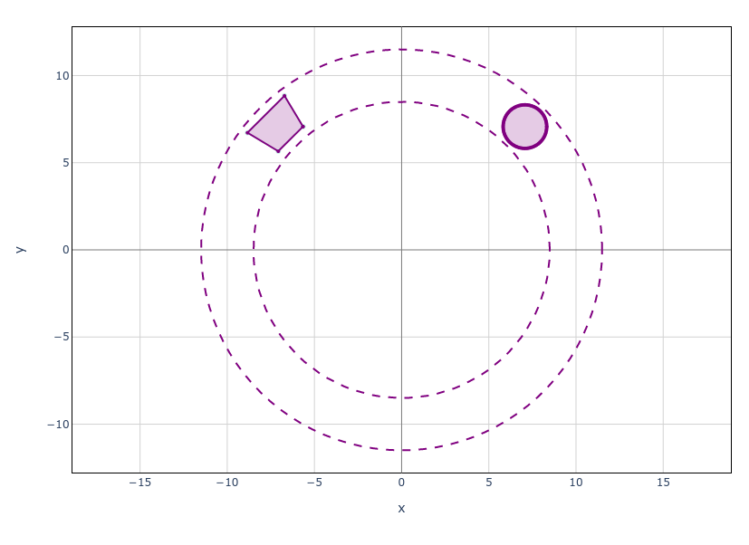

.. include:: ../../constants.rst

.. _section-tutorials_polygonfile_write:

Creating Polygon Files
======================

A common preprocessing step prior to running a Maha Multics simulation is to
create polygon files defining boundary conditions.  This section describes how
to create geometry with the :py:mod:`mahautils.shapes` module and write polygon
files with the :py:class:`mahautils.multics.PolygonFile` class.

.. note::

    For more details on the format of polygon files, refer to
    the :ref:`fileref-polygon_file` page.

.. _section-tutorials_polygonfile_write-geometry:

Tutorial Geometry
-----------------

For this tutorial, we will create a polygon file for a hypothetical case
depicted below.  Note that this geometry is not representative of a real pump;
it is purely for demonstration purposes.

In this hypothetical example, the yellow surface is intended to represent a
lubricating film, and the indicated ports are locations where polygons need to
be defined so that constant-pressure boundary conditions can be imposed.  Two
shapes need to be captured: (1) a trapezoid and (2) a circle.  In addition,
notice that as indicated by the red arrows, the entire geometry rotates, so
the polygon file needs to incorporate this motion.

The figure below shows a dimensioned view of the geometry and coordinate system
which will be used in the remainder of the tutorial.

For this tutorial, we will assume that all dimensions are in **millimeters**.

Setup
-----

To begin, open a Python terminal and import the classes from the |PackageNameStylized|
package that will be used in this tutorial:

>>> from mahautils.multics import PolygonFile
>>> from mahautils.shapes import Circle, Layer, Polygon

Note that we could have imported the entire |PackageNameStylized| package
(e.g., ``import mahautils``), but importing specific classes only will make
the tutorial code simpler and easier to understand.

Creating the Geometry
---------------------

General Concepts
^^^^^^^^^^^^^^^^

The intention of the :py:mod:`mahautils.shapes` package is to function similar to
a graphics editor such as `Inkscape <https://inkscape.org/>`__.  Individual shapes
(circles, points, etc.) can be defined, and to aid in organizing complex geometry,
shapes can be grouped in **layers** and layers can be grouped in a **canvas**.

Sometimes, it may be desirable to include **construction** geometry.  This can be
specified by setting the :py:attr:`mahautils.shapes.Shape2D.construction` property
to ``True``, and it signifies that the geometry should be included for visualization
purposes, but it is only for reference and should not be written into a polygon
file.  For instance, this can be useful for defining the outer perimeter of the
sealing land or hidden geometry.

Defining Geometry at Initial Position
^^^^^^^^^^^^^^^^^^^^^^^^^^^^^^^^^^^^^

Let's first see how to define the port geometry in the initial position
shown :ref:`above <section-tutorials_polygonfile_write-geometry>`.  There are
several shapes that need to be defined, so first create
a :py:class:`mahautils.shapes.Layer` to store them, optionally choosing the
color to use when plotting the layer:

>>> layer_t0 = Layer(color='purple')

Two shapes need to be created to represent the ports: (1) a circle and (2) a
trapezoid.  These shapes can be created with the :py:class:`mahautils.shapes.Circle`
and :py:class:`mahautils.shapes.Polygon` classes, respectfully, using the geometry
shown in the :ref:`previous diagrams <section-tutorials_polygonfile_write-geometry>`:

>>> circle = Circle(center=(10, 0), diameter=2.5, units='mm',
...                 default_num_coordinates=100)
>>> trapezoid = Polygon(vertices=[[1, 9], [1.5, 11], [-1.5, 11], [-1, 9]],
...                     units='mm')

A few things to notice about these definitions:

- Units were specified with the ``units`` keyword argument.  The commands above
  would still have worked even if we ommitted this argument, but this would cause
  issues later when writing the polygon file.
- When plotting shapes with the :py:mod:`mahautils.shapes` package, the shapes are
  discretized into discrete points for plotting.  The ``default_num_coordinates``
  argument controls how many points are used to discretize the circle.  However, it
  is not required for the trapezoid since a finite number of vertices were explicitly
  specified.

It can also be helpful to define construction geometry such as the inner and outer
radii of the sealing land to provide a reference in visualization plots.  Such
geometry can be created with:

>>> circle_inner = Circle(center=(0, 0), diameter=17, units='mm',
...                       default_num_coordinates=100, construction=True)
>>> circle_outer = Circle(center=(0, 0), diameter=23, units='mm',
...                       default_num_coordinates=100, construction=True)

Now, we need to add all the shapes we created to the layer.
The :py:class:`mahautils.shapes.Layer` class functions the same way as a Python
``list``, so any of the methods for modifying Python lists can be applied to the
layer.  For instance, we can extend the layer with the previously created shapes:

>>> layer_t0.extend([circle, trapezoid, circle_inner, circle_outer])

Finally, we can visualize the geometry we just set up using the
:py:meth:`mahautils.shapes.Layer.plot` method:

>>> layer_t0.plot()  # doctest: +SKIP

Running this should open a browser and show a figure similar to:

Defining Rotated Geometry
^^^^^^^^^^^^^^^^^^^^^^^^^

So far, we have created a layer with our desired geometry at the initial position
However, as mentioned :ref:`previously <section-tutorials_polygonfile_write-geometry>`,
the port geometry rotates.  To include such rotating geometry in a polygon file, **we
need to generate layers with the rotated geometry for an arbitrary rotation angle**.

One option to handle rotating geometry is to manually calculate the position of each
shape for every rotation angle.  However, this is fairly tedious and error-prone.
A simpler approach is that since we have already defined the desired geometry, we
can rotate it using the :py:meth:`mahautils.shapes.Layer.rotate` method.

For instance, one way to implement this is to create a function that generates a new
:py:class:`mahautils.shapes.Layer` instance by rotating the geometry defined in the
previous section:

>>> def layer_at_angle(angle, angle_units):
...     layer = Layer(color='purple')
...
...     layer.append(Circle(center=(10, 0), diameter=2.5, units='mm',
...                         default_num_coordinates=100))
...     layer.append(Polygon(vertices=[[1, 9], [1.5, 11], [-1.5, 11], [-1, 9]],
...                          units='mm'))
...
...     layer.append(Circle(center=(0, 0), diameter=17, units='mm',
...                         default_num_coordinates=100, construction=True))
...     layer.append(Circle(center=(0, 0), diameter=23, units='mm',
...                         default_num_coordinates=100, construction=True))
...
...     layer.rotate(center=(0, 0), angle=angle, angle_units=angle_units)
...
...     return layer

Now, we should be able to generate the geometry rotated to any angle.  For
instance, to plot the geometry at :math:`45^\circ`, run:

>>> layer_at_angle(45, 'deg').plot()  # doctest: +SKIP

This should generate a plot similar to:

Creating the Polygon File
-------------------------

So far, we have focused on setting up the geometry that we will store in the
polygon file, and we have created a function ``layer_at_angle()`` which generates
a :py:class:`mahautils.shapes.Layer` containing the port geometry rotated to
any angle.  In this section, we will see how to save these data as a polygon file.

General Properties
^^^^^^^^^^^^^^^^^^

First, begin by initializing a :py:class:`mahautils.multics.PolygonFile` object:

>>> polygon_file = PolygonFile()

Next, there are a few general parameters which need to be defined.  We want points
inside of either port to be considered boundary conditions, so set:

>>> polygon_file.polygon_merge_method = 0

In addition, for this polygon file, we will define "time" in terms of rotation
angle.  The term "time" is used loosely with polygon files to define an independent
variable based upon which the geometry is determined.  In this case, the port positions
in the geometry shown :ref:`previously <section-tutorials_polygonfile_write-geometry>`
will always be in known locations based on rotation angle, so it makes sense to define
"time" based on rotation angle.  If "time" were defined in seconds, the port positions
would could not be determined as a function of time unless the rotational speed was
constant, so defining "time" in terms of rotation angle is more general.  Therefore,
the following properties can be set:

>>> polygon_file.time_extrap_method = 3
>>> polygon_file.time_units = 'deg'

For more detail about these general polygon file properties, refer to
the :ref:`fileref-polygon_file` page.

Adding Time Steps
^^^^^^^^^^^^^^^^^

Once a :py:class:`mahautils.multics.PolygonFile` instance has been created,
we can easily add data to it for every time step by accessing the
:py:class:`mahautils.multics.PolygonFile.polygon_data` attribute.  This
attribute is a dictionary in which the keys are "times" and the values are
layers with the geometry.

Using our ``layer_at_angle()`` function, we can add polygon data for all
time steps at :math:`1^\circ` increments:

>>> for i in range(0, 360):
...     polygon_file.polygon_data[i] = layer_at_angle(i, 'deg')

Generating a Preview Plot
^^^^^^^^^^^^^^^^^^^^^^^^^

The :py:meth:`mahautils.multics.PolygonFile.plot` method can be used to generate
an animation to preview the polygon file geometry:

>>> polygon_file.plot()  # doctest: +SKIP

There are a number of more advanced plotting options available.  For further
detail, refer to the :ref:`section-tutorials_polygonfile_read` tutorial.

Writing to a File
^^^^^^^^^^^^^^^^^

Once we have verified that the polygon file contains the desired geometry, the
polygon file can be saved to the disk with the
:py:meth:`mahautils.multics.PolygonFile.write` method:

>>> polygon_file.write('polygon_file.txt')  # doctest: +SKIP

This should write the polygon data to an output file called ``polygon_file.txt``
in your working directory.
